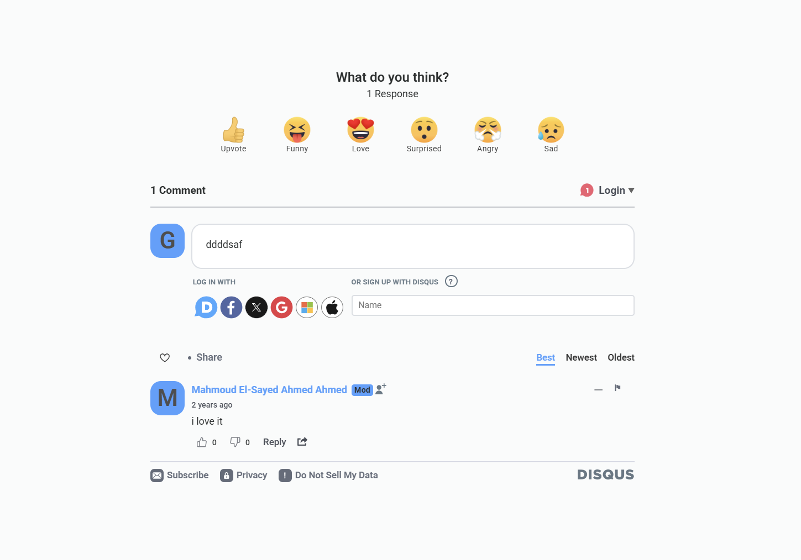
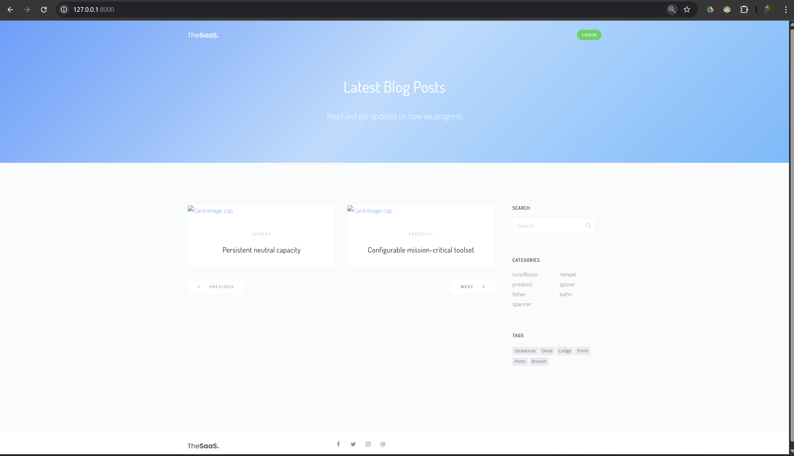

# 📝 Blog: Modern Blogging Platform

## App Screenshot

<p align="center">
  
  
  
</p>

A sleek, interactive blogging platform where users can create, share, and discuss posts with a clean UI and powerful moderation tools.


✨ Why VueBlog?

📝 Write & Publish – Markdown support, drafts, and rich editing

💬 Engage – Comment threads with replies and reactions

🔐 Secure – JWT authentication & role-based permissions

📱 Responsive – Works on desktop, tablet, and mobile

⚡ Fast – Optimized Vue 3 + Vite performance

## 🛠️ Installation Guide

### 📋 Prerequisites
- PHP 8.1+
- Composer 2.0+
- MySQL 8.0+ (or Docker)
- NPM/Yarn

### ⚙️ Environment Configuration

1. Copy the environment template:

   
   Create file name .env 
   then copy the .env.example to .env file
   

🧰 Dependency Installation
# Install PHP dependencies

```bash
composer install
```
# Install JavaScript dependencies

```cmd
 npm install
```
🗃️ Database Setup

Using Docker (Recommended)
bash

Ensure that docker installed and running then run

```bash
docker compose up 
```


Create a database named VueState

Update your .env with correct credentials

🌐 Access the Adminer DB at: http://localhost:8080/

Choose :-

System : MySQL / MariaDB 

Server : MySQL 

Username : root 

password : root

Run migrations:
```bash
php artisan migrate --seed
```

🚦 Running the Application
Start the development servers in two separate terminals:

Backend Server:

```bash
php artisan serve
```

Frontend Assets:

```bash
npm run dev
```

🌐 Access the application at: http://localhost:8000


🚨 Troubleshooting
Issue	Solution
Database connection errors	Verify MySQL service is running
Asset compilation issues	Run npm run build
Permission errors	Run chmod -R 775 storage bootstrap/cache
Missing APP_KEY	Run php artisan key:generate

🔐 Authentication & Roles
Admin → Full control (delete posts/comments)

Authors → Create & edit their own posts

Users → Comment & react

Default Test User:

Email: admin@example.com

Password: admin123

🚀 Features
✔ Blog Management

Create, edit, delete posts

Markdown & rich-text editor

Drafts & scheduled publishing

✔ Comment System

Nested replies

Upvote/downvote

Moderation controls

✔ User Dashboard

Profile customization

Post history

Saved bookmarks

✔ Admin Panel

Manage users

Delete inappropriate content

Analytics
